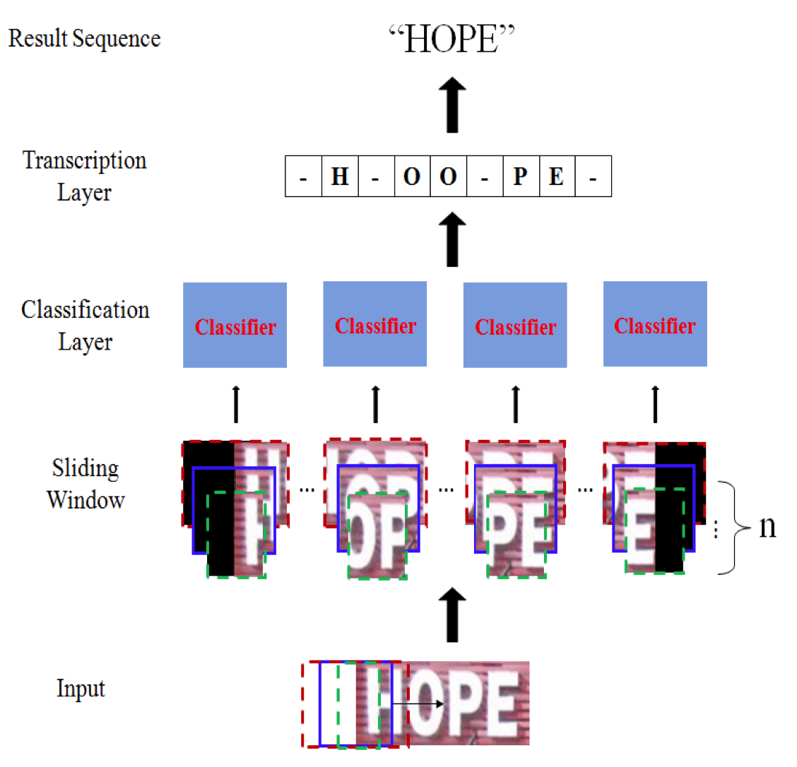

# Sliding Convolution CTC for Scene Text Recognition

Implementation of 'Scene Text Recognition with Sliding Convolutional Character Models'([pdf](https://arxiv.org/pdf/1709.01727))

### Model

Sliding windows + CNN + CTC

<div align=center>

</div>


### Dependency

While this implement might work for many cases, it is only tested for environment below:

```
python == 3.7.0
torch == 0.4.1
tqdm
numpy
```

```
warp-ctc(for pytorch 0.4)
```

```
CUDA 9.0.1
CUDNN 7.0.5
```

#### Install warp-ctc

Follow this [instruction](https://github.com/SeanNaren/warp-ctc/tree/0.4.1)

> **Note**:Version of warp-ctc should be corresponding with pytorch. [Related issue](https://github.com/SeanNaren/warp-ctc/issues/101)

### Usage

Download [IIIT5K dataset](https://cdn.iiit.ac.in/cdn/cvit.iiit.ac.in/projects/SceneTextUnderstanding/IIIT5K-Word_V3.0.tar.gz) and release files to dataset folder.

Preprocess IIIT5K dataset
```bash
python3 prepare_IIIT5K_dataset.py
```

Train model:
```bash
python3 main.py --cuda=True --mode=train
```
Resume training:
```bash
python3 main.py --cuda=True --wram-up=True --mode=train
```
Test model:
```bash
python3 main.py --cuda=True --mode=test
```

> **Note**: `model.bin` file is a pre-trained model which could achieve about 53% accuracy. (Due to the small training dataset)

### Citation

If you find this work is useful in your research, please consider citing:

```
@article{yin2017scene,
  title={Scene text recognition with sliding convolutional character models},
  author={Yin, Fei and Wu, Yi-Chao and Zhang, Xu-Yao and Liu, Cheng-Lin},
  journal={arXiv preprint arXiv:1709.01727},
  year={2017}
}
```
